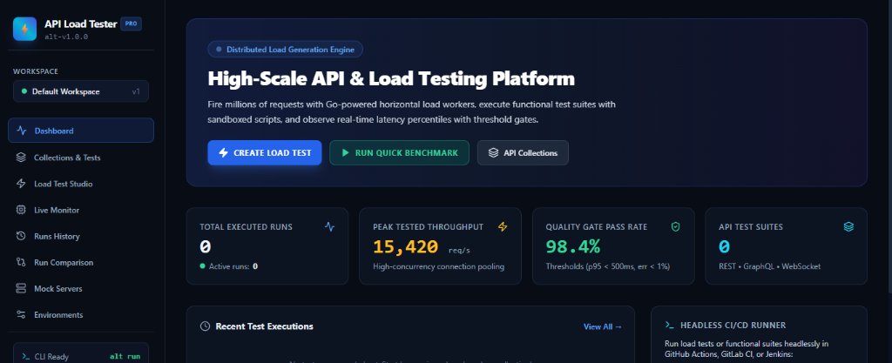
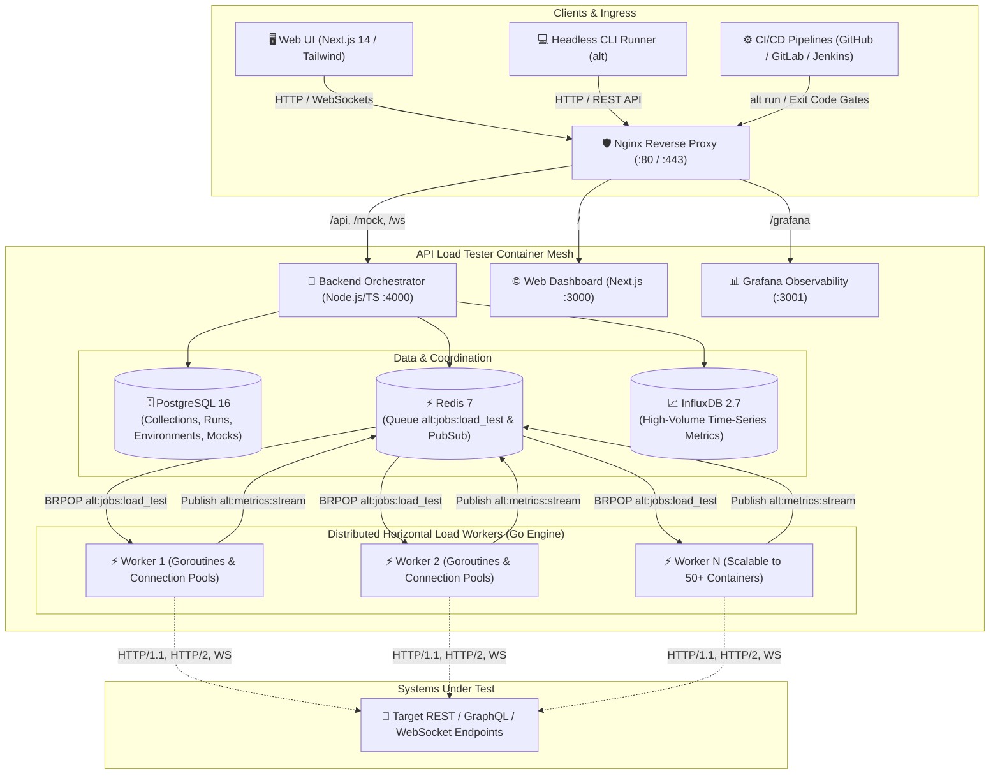

<div align="center">

# ⚡ api-load-tester (`alt`)
### *The Production-Grade, Containerized API Testing & Massive-Scale Load Generation Platform*

[](https://github.com/api-load-tester/api-load-tester/actions/workflows/ci.yml)
[](https://www.docker.com/)
[](https://golang.org)
[](https://nodejs.org/)
[](https://nextjs.org/)
[](https://grafana.com/)
[](https://opensource.org/licenses/MIT)

**Postman + k6 + Grafana combined into a single, fully-containerized, horizontally scalable platform.**

[Quickstart](#-quickstart-in-60-seconds) • [Architecture](#-architecture) • [Feature Matrix](#-feature-comparison-matrix) • [Core Capabilities](#-core-capabilities) • [CLI Manual](#-headless-cli-manual-alt) • [Docker Stack](#-docker-setup--deployment) • [REST API Reference](#-rest-api-reference) • [CI/CD Pipelines](#-cicd-pipeline-integrations)

<br />

<p align="center">
  
</p>

</div>

## 📌 GitHub Topics
`api-testing`, `load-testing`, `performance-testing`, `qa-automation`, `stress-testing`, `devops`, `docker`, `ci-cd`, `api-monitoring`, `k6-alternative`

---

## 📊 Feature Comparison Matrix

| Capability | Postman | k6 (Grafana Labs) | JMeter | **api-load-tester (`alt`)** |
|:---|:---:|:---:|:---:|:---:|
| **REST / GraphQL / WebSocket Testing** | ✅ (REST/WS) | ⚠️ (Script-heavy) | ⚠️ (XML-heavy) | ✅ **Native UI & Protocol Engine** |
| **Visual Request Builder & Sandbox** | ✅ Excellent | ❌ Code-only | ❌ Clunky UI | ✅ **Postman-Grade Visual Suite** |
| **Variable Chaining (`{{var}}`) & Scripts** | ✅ Yes (`pm.*`) | ⚠️ Manual JS code | ⚠️ Complex regex | ✅ **Sandboxed JS VM (`pm.*` API)** |
| **High-Scale Load Generation (1M+ reqs)** | ❌ No (Low RPS) | ✅ Yes (Go/JS) | ⚠️ Java JVM memory bloat | ✅ **Distributed Go Worker Mesh** |
| **Horizontal Worker Scaling** | ❌ No | ⚠️ Enterprise only | ⚠️ Complex master/slave | ✅ **Native (`--scale load-worker=N`)** |
| **Zero-Memory Quantile Streaming** | ❌ Buffers all | ⚠️ Influx/K6 Cloud | ❌ Buffers to disk | ✅ **O(1) Reservoir Sampling** |
| **Live Web Dashboard via WebSockets** | ❌ Run summary only | ⚠️ Needs Grafana setup | ❌ No live web UI | ✅ **Real-Time Next.js 14 Dashboard** |
| **Pass/Fail Threshold Quality Gates** | ⚠️ Limited | ✅ Yes (`thresholds`) | ⚠️ CLI plugins | ✅ **Visual & CLI Gates (Exit 0/1)** |
| **Side-by-Side Run Regression Diff** | ❌ Manual | ❌ No | ❌ No | ✅ **Built-in Visual Diff & Deltas** |
| **Contract Mock Server** | ⚠️ Cloud-only/paid | ❌ No | ❌ No | ✅ **Built-in Mock Engine with Delays** |
| **CI/CD Headless CLI** | ⚠️ Newman (heavy) | ✅ Lightweight | ❌ Heavy | ✅ **Headless `alt` binary (JUnit/HTML)** |
| **Complete Self-Hosted Docker Stack** | ❌ Cloud-dependent | ⚠️ Self-assembly | ⚠️ Manual Docker | ✅ **1-Command `docker compose up -d`** |

---

## 🏗️ Architecture

`api-load-tester` is engineered with clean separation between orchestration, load generation, metrics aggregation, and visualization:



### Architectural Highlights
1. **Separation of Concerns**: The Node.js orchestrator handles metadata, JS sandbox VM evaluation, and REST APIs, while dedicated Go worker containers fire raw requests with zero GC overhead.
2. **Zero-Memory Quantile Streaming**: Workers use Vitter's reservoir sampling algorithms. Rather than storing millions of raw request objects in RAM (which causes OOM crashes in other tools), metrics are aggregated into fixed-capacity rolling windows and pushed to Redis PubSub and InfluxDB.
3. **Connection Pooling & Socket Reuse**: Custom `http.Transport` with 50,000 max idle connections and zero-copy body draining (`io.Copy(io.Discard, resp.Body)`) ensures maximum socket reuse without TCP port exhaustion (`TIME_WAIT`).

---

## 🌟 Core Capabilities

### 1. Functional API Testing (Postman Equivalent)
- **Protocol Flexibility**: Native support for REST, GraphQL (queries & variable payloads), and WebSocket endpoints.
- **Request Builder**:
  - HTTP Methods: `GET`, `POST`, `PUT`, `DELETE`, `PATCH`, `HEAD`, `OPTIONS`.
  - Parameters: Query parameters table, headers editor with auto-completion.
  - Body Formats: `JSON`, `form-data`, `raw text`, and `GraphQL`.
  - Authentication: Bearer Token, Basic Auth, API Key (Header or Query), and JWT.
- **Variable Chaining**: Extract values dynamically from Response A via JavaScript sandbox scripts and interpolate them into subsequent requests using `{{variableName}}`.
- **Pre-Request & Post-Response Scripts**: Sandboxed JavaScript execution environment providing:
  - `pm.environment.get(key)` / `pm.environment.set(key, val)`
  - `pm.variables.get(key)` / `pm.variables.set(key, val)`
  - `pm.response.code`, `pm.response.responseTime`, `pm.response.headers`, `pm.response.json()`
  - `pm.test(name, fn)` with Chai-compatible `pm.expect()` assertions (`.to.equal()`, `.to.be.below()`, `.to.include()`, `.to.have.property()`).
- **Assertion Rules**:
  - Status code matching (`equals`, `less_than`, `not_equals`)
  - Latency thresholds (`responseTime <= 500ms`)
  - Strict JSON Schema validation using Ajv (Draft-07 & 2020-12)
  - JSONPath expression matchers (`$.data.items[0].id == 101`)
  - Header validation and regex body matching
- **Data-Driven Parameterization**: Run collections against CSV or JSON rows for parameterized testing.
- **Contract Mock Server**: Built-in mock endpoints with configurable status codes, response headers, JSON payloads, and simulated network delays accessible at `/mock/:workspaceId/*`.

### 2. Massive-Scale Load & Stress Testing (k6 Equivalent)
- **Scale to Millions of Requests**: Built on an ultra-lightweight, high-concurrency Go worker engine utilizing TCP connection pooling, HTTP/2 multiplexing, and zero-copy stream draining.
- **Horizontal Scaling**: Scale worker containers on demand with a single Docker command:
  ```bash
  docker compose up -d --scale load-worker=10
  ```
- **Load Profiles**:
  - **Constant Load**: Steady number of Virtual Users (VUs) over time.
  - **Ramp-Up / Ramp-Down**: Gradual increase and decrease of concurrent users.
  - **Spike Testing**: Sudden explosive bursts in concurrency to test resilience.
  - **Stress Testing**: Progressive ramping to find breaking points.
  - **Soak / Endurance Testing**: Sustained moderate traffic over long durations to uncover memory leaks.
  - **Breakpoint Testing**: Uncapped gradual ramp until system failure is detected.
- **Token-Bucket RPS Throttling**: Cap request rates at targeted RPS thresholds to prevent overwhelming test environments prematurely.
- **Protocol Support**: HTTP/1.1, HTTP/2, and WebSocket connection probes.

### 3. Real-Time Observability & Quality Gates (Grafana Equivalent)
- **Live WebSocket Dashboard**: Stream real-time performance graphs directly to the browser (RPS, active VUs, latency percentiles, status codes, and error rate).
- **Quality Gate Thresholds**: Define strict pass/fail criteria (e.g., fail build if `p95 > 500ms` or `error_rate > 1%`).
- **Pre-Provisioned Grafana Dashboards**: Built-in Prometheus metrics exporter (`/api/metrics`) and InfluxDB time-series storage.
- **Side-by-Side Run Comparison**: Compare two test runs side-by-side with regression delta calculations.
- **Export Formats**: One-click download of interactive standalone HTML reports, JUnit XML for CI/CD test viewers, and JSON.
- **Webhook Alerts**: Automated notifications dispatched to Slack, Discord, or custom webhooks upon run completion or quality gate failures.

---

## ⚡ Quickstart in 60 Seconds

### Step 1: Clone and Configure
```bash
git clone https://github.com/api-load-tester/api-load-tester.git
cd api-load-tester
cp .env.example .env
```

### Step 2: Spin Up the Entire Platform
```bash
docker compose up -d
```

### Step 3: Access the Web Applications
| Application | URL | Default Credentials |
|---|---|---|
| **Web UI Dashboard** | [http://localhost](http://localhost) (or port 80 / 3000) | No auth required |
| **Backend API** | [http://localhost:4000/api](http://localhost:4000/api) | No auth required |
| **Prometheus Metrics** | [http://localhost:4000/api/metrics](http://localhost:4000/api/metrics) | No auth required |
| **Grafana Dashboards** | [http://localhost:3001](http://localhost:3001) (or `/grafana/`) | `admin` / `admin` |
| **Mock Server Engine** | [http://localhost:4000/mock/default/*](http://localhost:4000/mock/default/*) | Public |

---

## 🐳 Horizontal Scaling to Millions of Requests

To generate high-throughput load across multiple cores or distributed machines, scale the Go load workers horizontally:

```bash
# Launch 10 parallel Go worker containers
docker compose up -d --scale load-worker=10

# Scale up to 25 workers for multi-million request stress runs
docker compose up -d --scale load-worker=25
```

Each worker automatically registers with the Redis queue `alt:jobs:load_test`, pulls partitioned load test stages, and streams non-blocking rolling percentiles to `alt:metrics:stream`.

---

## 💻 Headless CLI Manual (`alt`)

The `alt` command-line tool enables headless functional testing and load test execution in continuous integration environments.

### Installation
```bash
cd cli
npm install
npm run build
npm link
```

### Commands & Options

#### 1. Run a Load Test Against a Target URL
```bash
alt run https://httpbin.org/get \
  --vus 100 \
  --duration 30s \
  --rps 5000 \
  --thresholds "p95<500,error_rate<0.01" \
  --reporters junit,json,html \
  --output ./test-reports
```

#### 2. Run a Functional Test Collection
```bash
alt run ./examples/collections/sample_rest_api.json \
  --env ./examples/environments/local.json
```

#### 3. Run Public Demo Collection (No local server required)
```bash
alt run ./examples/collections/httpbin_demo.json
```

#### 4. Convert Postman Collections or OpenAPI Specs
```bash
# Convert Postman v2.1 collection to ALT JSON
alt convert ./my_postman_collection.json ./collection.alt.json

# Convert OpenAPI 3.0 / Swagger YAML to ALT JSON
alt convert ./openapi.yaml ./api_tests.alt.json
```

### CLI Flag Reference
| Flag | Description | Default |
|---|---|---|
| `-u, --vus <number>` | Number of concurrent virtual users | `10` |
| `-d, --duration <time>` | Test duration (e.g. `30s`, `5m`, `1h`) | `10s` |
| `-r, --rps <number>` | Requests Per Second (RPS) throttle limit | Unlimited |
| `-e, --env <pathOrJson>` | Path to environment JSON or inline JSON string | Auto-discovered |
| `-t, --thresholds <rules>` | Threshold rules (e.g. `"p95<500,error_rate<0.01"`) | Configured in file |
| `--reporters <types>` | Comma-separated output formats (`junit,json,html`) | Terminal only |
| `-o, --output <dir>` | Output folder for generated reports | `./reports` |
| `--api <url>` | Remote API Load Tester backend URL | `http://localhost:4000` |

---

## 🐳 Docker Setup & Deployment

### Service Inventory
Every service in `docker-compose.yml` is configured with multi-stage Dockerfiles, health checks, persistent volumes, and isolated networks:

```yaml
services:
  nginx:       # Reverse proxy routing /api, /ws, /mock, /grafana, and /
  app:         # Node.js 22 TypeScript API & functional execution engine
  web:         # Next.js 14 App Router dashboard with standalone runner
  load-worker: # Scalable Go 1.23 high-concurrency worker (scales via --scale)
  postgres:    # PostgreSQL 16 database storing collections, runs, and mocks
  redis:       # Redis 7 Alpine coordinating jobs and real-time pub/sub
  influxdb:    # InfluxDB 2.7 high-throughput time-series metrics store
  grafana:     # Grafana 11 with pre-provisioned dashboards and datasources
```

### Local Development with Hot Reload
To develop locally with live TypeScript compilation and Next.js Fast Refresh:
```bash
# Copy development override
cp docker-compose.override.yml.example docker-compose.override.yml

# Start stack with hot-reload volume mounts
docker compose up
```

### Environment Variables Reference (`.env`)
| Variable | Description | Default |
|---|---|---|
| `PORT_HTTP` | Host port exposed by Nginx reverse proxy | `80` |
| `POSTGRES_USER` | Database username | `postgres` |
| `POSTGRES_PASSWORD` | Database password | `postgres` |
| `POSTGRES_DB` | Database schema name | `api_load_tester` |
| `INFLUXDB_USER` | InfluxDB administrative user | `alt_admin` |
| `INFLUXDB_PASSWORD` | InfluxDB administrative password | `AltSecurePassword123!` |
| `INFLUXDB_ORG` | InfluxDB organization name | `alt` |
| `INFLUXDB_BUCKET` | InfluxDB bucket name | `metrics` |
| `INFLUXDB_TOKEN` | InfluxDB API authentication token | `alt-secret-token-super-secure` |
| `GRAFANA_USER` | Grafana administrative user | `admin` |
| `GRAFANA_PASSWORD` | Grafana administrative password | `admin` |
| `WORKER_CPU_LIMIT` | CPU limit allocated per load worker container | `2.0` |
| `WORKER_MEM_LIMIT` | RAM limit allocated per load worker container | `1024M` |
| `DEFAULT_WEBHOOK_URL` | Global Slack / Discord webhook notification URL | `""` |

---

## 🔌 REST API Reference

The backend orchestrator provides a comprehensive REST API:

### Core Endpoints

#### 1. Health & Prometheus Metrics
- `GET /health` — Check system status.
- `GET /api/metrics` — Prometheus scrape endpoint exposing `alt_load_requests_total`, `alt_request_duration_seconds`, `alt_active_virtual_users`, and `alt_active_load_workers`.

#### 2. Functional Collections
- `GET /api/collections` — List all collections in the workspace.
- `GET /api/collections/:id` — Retrieve collection details and request items.
- `POST /api/collections` — Create a new test collection:
  ```json
  {
    "name": "User Service Tests",
    "workspaceId": "default",
    "data": {
      "name": "User Service Tests",
      "items": [
        {
          "id": "req-1",
          "name": "Get User Profile",
          "method": "GET",
          "url": "{{baseUrl}}/users/1",
          "assertions": [{ "type": "status_code", "operator": "equals", "value": 200 }]
        }
      ]
    }
  }
  ```
- `PUT /api/collections/:id` — Update collection content.
- `DELETE /api/collections/:id` — Delete collection.

#### 3. Test Execution & Runs
- `POST /api/runs/functional` — Trigger an asynchronous functional test suite run:
  ```json
  {
    "collectionId": "col-rest-sample",
    "environment": { "baseUrl": "http://localhost:4000" },
    "parallel": false
  }
  ```
- `POST /api/runs/load` — Trigger a distributed load test:
  ```json
  {
    "name": "Checkout API Stress Test",
    "workspaceId": "default",
    "config": {
      "targetUrl": "http://localhost:4000/health",
      "method": "GET",
      "stages": [
        { "duration": 15, "targetVUs": 50 },
        { "duration": 30, "targetVUs": 250 },
        { "duration": 15, "targetVUs": 0 }
      ],
      "maxRps": 10000,
      "thresholds": [
        { "metric": "p95", "operator": "<", "value": 500 },
        { "metric": "error_rate", "operator": "<", "value": 0.01 }
      ]
    }
  }
  ```
- `POST /api/runs/:id/stop` — Cancel an ongoing load test across all distributed workers.
- `GET /api/runs/:id` — Fetch complete run summary, percentiles, and assertion results.
- `GET /api/runs/compare/:runA/:runB` — Side-by-side run regression diff calculation.

#### 4. Report Exports
- `GET /api/export/:runId/html` — Download interactive, standalone HTML test report.
- `GET /api/export/:runId/junit` — Download JUnit XML test report for CI/CD integration.
- `GET /api/export/:runId/json` — Download complete JSON results.

#### 5. Importers
- `POST /api/import/postman` — Import Postman Collection JSON (v2.0/v2.1).
- `POST /api/import/openapi` — Import OpenAPI 3.0 / Swagger JSON or YAML.

#### 6. Dynamic Mock Server
- `ALL /mock/:workspaceId/*` — Matches mock endpoint by method and path. Returns custom status code, custom headers, and body with simulated latency.

---

## ⚙️ CI/CD Pipeline Integrations

### GitHub Actions
Save to `.github/workflows/perf-quality-gate.yml`:
```yaml
name: Performance Quality Gate

on: [push, pull_request]

jobs:
  load-test:
    runs-on: ubuntu-latest
    steps:
      - name: Checkout Code
        uses: actions/checkout@v4

      - name: Setup Node.js
        uses: actions/setup-node@v4
        with:
          node-version: 22

      - name: Install ALT CLI
        run: |
          cd cli
          npm ci && npm run build
          npm link

      - name: Run Load Test with Quality Gate
        run: |
          alt run https://httpbin.org/get \
            --vus 50 \
            --duration 20s \
            --thresholds "p95<800,error_rate<0.02" \
            --reporters junit,json \
            --output ./test-results

      - name: Publish Test Report
        uses: mikepenz/action-junit-report@v4
        if: always()
        with:
          report_paths: 'test-results/junit-load.xml'
```

### GitLab CI
Save to `.gitlab-ci.yml`:
```yaml
stages:
  - performance

performance_test:
  stage: performance
  image: node:22-alpine
  script:
    - cd cli && npm ci && npm run build && npm link && cd ..
    - alt run ./examples/load-tests/spike_test.json --reporters junit --output ./reports
  artifacts:
    when: always
    reports:
      junit: reports/junit-load.xml
```

### Jenkins Pipeline
Save to `Jenkinsfile`:
```groovy
pipeline {
    agent any
    stages {
        stage('Load Test') {
            steps {
                sh '''
                    cd cli
                    npm install
                    npm run build
                    node bin/alt.js run https://httpbin.org/get \
                      --vus 100 \
                      --duration 30s \
                      --thresholds "p95<1000,error_rate<0.01" \
                      --reporters junit \
                      --output ./reports
                '''
            }
        }
    }
    post {
        always {
            junit 'reports/junit-load.xml'
        }
    }
}
```

---

## 💡 Practical Tutorials & Walkthroughs

### 1. Auth Chaining & Variable Extraction
Demonstrates authenticating against a login endpoint, extracting a Bearer token via JS sandbox, and injecting it into secured endpoints.

```json
{
  "id": "auth-flow",
  "name": "Auth Chaining Demo",
  "items": [
    {
      "id": "step-1",
      "name": "Login",
      "method": "POST",
      "url": "{{baseUrl}}/auth/login",
      "body": {
        "type": "json",
        "content": { "username": "admin", "password": "secretPassword" }
      },
      "postResponseScript": "const res = pm.response.json(); pm.environment.set('token', res.token);",
      "assertions": [{ "type": "status_code", "operator": "equals", "value": 200 }]
    },
    {
      "id": "step-2",
      "name": "Get Profile",
      "method": "GET",
      "url": "{{baseUrl}}/user/profile",
      "auth": {
        "type": "bearer",
        "token": "{{token}}"
      },
      "assertions": [{ "type": "status_code", "operator": "equals", "value": 200 }]
    }
  ]
}
```

### 2. GraphQL Testing
```json
{
  "id": "gql-test",
  "name": "GraphQL User Query",
  "items": [
    {
      "id": "gql-1",
      "name": "Query User",
      "protocol": "graphql",
      "method": "POST",
      "url": "{{baseUrl}}/graphql",
      "body": {
        "type": "graphql",
        "graphql": {
          "query": "query GetUser($id: ID!) { user(id: $id) { name email } }",
          "variables": { "id": "42" }
        }
      },
      "assertions": [{ "type": "status_code", "operator": "equals", "value": 200 }]
    }
  ]
}
```

---

## ❓ Troubleshooting & FAQ

#### Q: Getting `Connection refused` when running `alt run` from host terminal
- **Cause**: The target server is either not running, or listening on a different port.
- **Fix**: 
  1. If testing local services, ensure Docker is running with `docker compose up -d`.
  2. If testing against a custom domain or staging API, specify `--api https://my-api.com` or pass an environment file with `--env my-env.json`.

#### Q: How do I test at million-request scale without exhausting memory?
- **Fix**: The Go load worker (`load-worker/`) uses reservoir sampling to keep memory usage constant at ~20MB RAM even across 10,000,000+ requests. Scale the containers using:
  ```bash
  docker compose up -d --scale load-worker=20
  ```

#### Q: In Next.js / Alpine containers, health check fails with `localhost`
- **Cause**: Alpine Linux `wget` attempts IPv6 `::1` before IPv4 `127.0.0.1`.
- **Fix**: All container health checks in `api-load-tester` use explicit IPv4 `127.0.0.1` and `ENV HOSTNAME="0.0.0.0"`.

---

## 🤝 Contributing

We welcome contributions from the community! Please read our [Contributing Guide](CONTRIBUTING.md) and [Code of Conduct](CODE_OF_CONDUCT.md) for details on submitting pull requests and running development builds.

---

## 📄 License

This project is licensed under the [MIT License](LICENSE).
