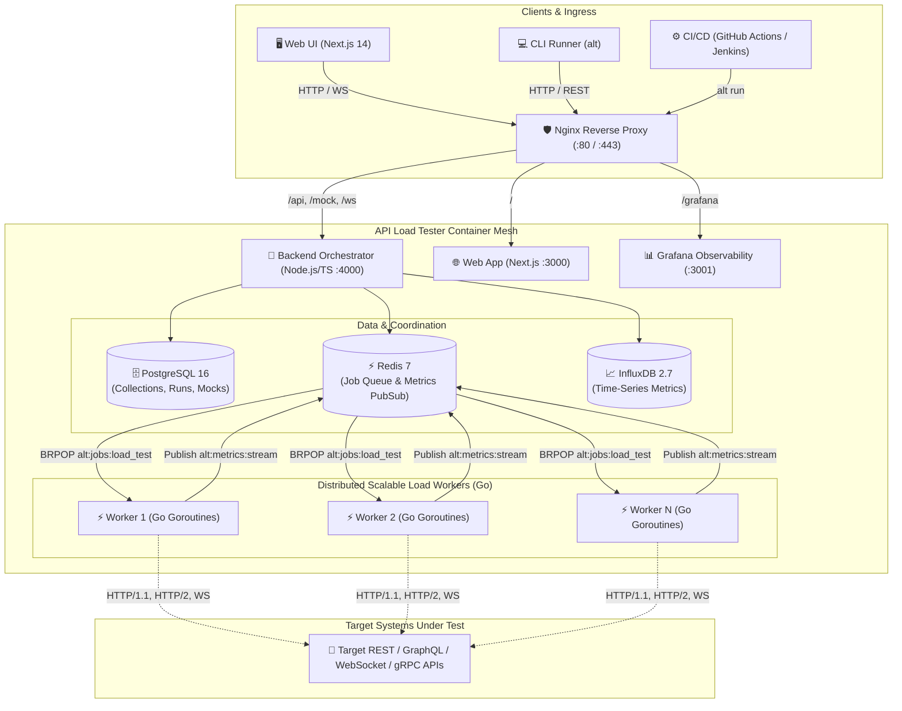

<div align="center">

# ⚡ API Load Tester (`alt`)
### *The Unified Platform for Functional API Testing, Distributed High-Scale Load Generation, and Real-Time Observability*

[](https://github.com/api-load-tester/api-load-tester/actions/workflows/ci.yml)
[](https://www.docker.com/)
[](https://golang.org)
[](https://nextjs.org/)
[](https://opensource.org/licenses/MIT)

**Postman + k6 + Grafana combined into a single, fully-containerized, production-grade platform.**

[Quickstart](#-quickstart-in-60-seconds) • [Architecture](#-architecture) • [Features](#-core-features) • [CLI Runner](#-headless-cli-alt) • [Horizontal Scaling](#-scaling-to-millions-of-requests) • [API & Endpoints](#-api-endpoints-reference)

---

</div>

## 📌 GitHub Topics
`api-testing`, `load-testing`, `performance-testing`, `qa-automation`, `stress-testing`, `devops`, `docker`, `ci-cd`, `api-monitoring`, `k6-alternative`

---

## 🏗️ Architecture



---

## 🌟 Core Features

### 1. Functional API Testing (Postman Equivalent)
- **Protocol Flexibility**: Full support for REST, GraphQL (queries & variables), and bidirectional WebSocket handshakes.
- **Visual Request Builder**: Method selector, query parameter tables, customizable headers, body formats (JSON, raw, form-data), and authentication (Bearer tokens, Basic auth, API Key in header/query, JWT).
- **Environment Variables & Chaining**: Extract values dynamically from Response A via JavaScript sandbox scripts and interpolate them into subsequent requests using `{{variableName}}`.
- **Sandboxed JavaScript Scripts**: Pre-request and post-response script sandbox providing `pm.environment`, `pm.variables`, `pm.response`, `pm.test()`, and full Chai-like `pm.expect()` assertions.
- **Rich Assertions Suite**:
  - HTTP status codes (equals, less_than, not_equals)
  - Latency thresholds (`responseTime <= 500ms`)
  - Strict JSON Schema validation (Ajv draft-07/2020-12)
  - JSONPath selectors (`$.data.user.id == 101`)
  - Header checks and Regular Expression body matchers
- **Data-Driven Parameterization**: Feed CSV or JSON datasets to execute iterations across user accounts or test vectors.
- **Contract Mock Server**: Built-in mock endpoints with configurable status codes, response headers, JSON payloads, and simulated network delays.

### 2. Massive-Scale Load & Stress Testing (k6 Equivalent)
- **Scale to Millions of Requests**: Built on an ultra-lightweight, high-concurrency Go worker engine utilizing TCP connection pooling, HTTP/2 multiplexing, and zero-copy stream draining without memory bloat.
- **Horizontal Worker Distribution**: Scale horizontally on demand with `docker compose up --scale load-worker=10` coordinated seamlessly via Redis queues.
- **Ramping Profiles**: Constant load, progressive ramp-up / ramp-down, spike testing, endurance/soak testing, stress testing, and breakpoint discovery.
- **Token-Bucket RPS Throttling**: Cap request rates at targeted RPS thresholds to prevent overwhelming test environments prematurely.
- **Streaming Metrics Reservoir**: Computes real-time rolling quantiles (p50, p90, p95, p99) via fixed-memory reservoir sampling—guaranteed zero OOM errors during massive 1M+ runs.

### 3. Real-Time Observability & Reporting (Grafana Equivalent)
- **Live WebSocket Dashboard**: Stream real-time performance graphs directly to the browser (RPS, active VUs, latency percentiles, status codes, and error rate).
- **Quality Gate Thresholds**: Define strict pass/fail criteria (e.g., fail build if `p95 > 500ms` or `error_rate > 1%`).
- **Pre-Provisioned Grafana Dashboards**: Built-in Prometheus metrics exporter (`/api/metrics`) and InfluxDB time-series storage.
- **Side-by-Side Run Comparison**: Compare two test runs side-by-side with regression delta calculations.
- **Export Formats**: One-click download of interactive standalone HTML reports, JUnit XML for CI/CD test viewers, and JSON.
- **Webhook Alerts**: Automated notifications dispatched to Slack, Discord, or custom webhooks upon run completion or quality gate failures.

---

## ⚡ Quickstart in 60 Seconds

### Step 1: Clone and Configure
```bash
git clone https://github.com/api-load-tester/api-load-tester.git
cd api-load-tester
cp .env.example .env
```

### Step 2: Launch the Full Containerized Stack
```bash
docker compose up -d
```

### Step 3: Access the Platform
- **Web UI Dashboard**: [http://localhost](http://localhost) (or port 80 / configured `PORT_HTTP`)
- **Backend API**: [http://localhost:4000/api](http://localhost:4000/api)
- **Prometheus Metrics**: [http://localhost:4000/api/metrics](http://localhost:4000/api/metrics)
- **Grafana Live Dashboards**: [http://localhost/grafana/](http://localhost/grafana/) *(Credentials: admin / admin)*
- **Mock Server Base**: [http://localhost/mock/default/*](http://localhost/mock/default/*)

---

## 🐳 Scaling to Millions of Requests

To generate massive throughput across a cluster, scale the Go load workers horizontally:

```bash
# Launch 10 parallel Go worker containers
docker compose up -d --scale load-worker=10

# Scale up to 25 workers for multi-million request stress runs
docker compose up -d --scale load-worker=25
```

Each worker automatically registers with the Redis queue `alt:jobs:load_test`, pulls partitioned load test stages, and streams non-blocking rolling percentiles to `alt:metrics:stream`.

---

## 💻 Headless CLI (`alt`)

The `alt` command-line tool enables headless functional testing and load test execution in continuous integration environments.

### Installation
```bash
cd cli
npm install
npm run build
npm link
```

### Usage Examples

#### Run a Load Test Against a Target URL
```bash
alt run http://localhost:4000/health \
  --vus 1000 \
  --duration 5m \
  --thresholds "p95<500,error_rate<0.01" \
  --reporters junit,json,html \
  --output ./reports
```

#### Run a Functional Collection
```bash
alt run ./examples/collections/sample_rest_api.json \
  --env ./examples/environments/local.json
```

#### Convert Postman Collection or OpenAPI Spec
```bash
alt convert ./postman_collection.json ./collection.alt.json
alt convert ./openapi_spec.yaml ./suite.alt.json
```

---

## 📊 CI/CD Automation Integration

### GitHub Actions Pipeline
```yaml
name: Performance Quality Gate

on: [push, pull_request]

jobs:
  load-test:
    runs-on: ubuntu-latest
    steps:
      - uses: actions/checkout@v4
      - name: Setup Node
        uses: actions/setup-node@v4
        with:
          node-version: 22

      - name: Install ALT CLI
        run: |
          cd cli
          npm ci && npm run build
          npm link

      - name: Run Quality Gate Load Test
        run: |
          alt run ./examples/load-tests/spike_test.json \
            --thresholds "p95<800,error_rate<0.02" \
            --reporters junit \
            --output ./test-results

      - name: Publish Test Report
        uses: mikepenz/action-junit-report@v4
        if: always()
        with:
          report_paths: 'test-results/junit-load.xml'
```

---

## 🔌 API Endpoints Reference

| Method | Endpoint | Description |
|---|---|---|
| `GET` | `/health` | Service health status |
| `GET` | `/api/metrics` | Prometheus metrics scrape target |
| `GET` | `/api/collections` | List workspace test collections |
| `POST` | `/api/collections` | Create or update collection |
| `POST` | `/api/runs/functional` | Trigger asynchronous functional test collection run |
| `POST` | `/api/runs/load` | Trigger distributed load test with stages & thresholds |
| `POST` | `/api/runs/:id/stop` | Emergency cancel/stop an ongoing test run |
| `GET` | `/api/runs/:id` | Fetch run summary, metrics, and assertion logs |
| `GET` | `/api/runs/compare/:runA/:runB` | Calculate side-by-side metrics diff and regression deltas |
| `GET` | `/api/export/:runId/html` | Download standalone interactive HTML report |
| `GET` | `/api/export/:runId/junit` | Download JUnit XML report for CI/CD |
| `POST` | `/api/import/postman` | Import Postman v2.1 collection JSON |
| `POST` | `/api/import/openapi` | Import OpenAPI 3.0 / Swagger JSON or YAML |
| `ALL` | `/mock/:workspaceId/*` | Live contract mock server handler |
| `WS` | `/ws` | Real-time WebSocket live metrics stream hub |

---

## 🖼️ User Interface Preview

```
┌──────────────────────────────────────────────────────────────────────────────────┐
│  ⚡ API Load Tester PRO              [ Default Workspace ]         alt run ready │
├───────────────┬──────────────────────────────────────────────────────────────────┤
│ 📊 Dashboard  │  ⚡ Live Load Test Monitor               [ RUNNING ]             │
│ 📁 Collections│  Run ID: run-98f12a • WebSocket Connected                       │
│ ⚡ Load Studio │ ──────────────────────────────────────────────────────────────── │
│ 🖥️ Live Monitor│ [ Total Requests ] [ Throughput ] [ p95 Latency ] [ Error Rate ] │
│ 📜 History    │     1,452,100          12,450 rps       142 ms          0.00%    │
│ 🔀 Compare    │ ──────────────────────────────────────────────────────────────── │
│ 🎭 Mocks      │   Latency Percentiles (p50, p90, p95, p99)                       │
│ ⚙️ Environments│   [~~~~~~~~~~~~📈 Real-time Interactive Curve 📈~~~~~~~~~~~~~]   │
│               │                                                                  │
│               │   Quality Gate Thresholds                                        │
│               │   ✓ PASS: p95 < 500ms (Actual: 142ms)                            │
│               │   ✓ PASS: error_rate < 0.01 (Actual: 0.000)                      │
└───────────────┴──────────────────────────────────────────────────────────────────┘
```

---

## 📄 License

This project is licensed under the [MIT License](LICENSE).
